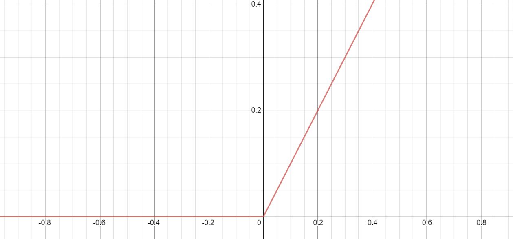
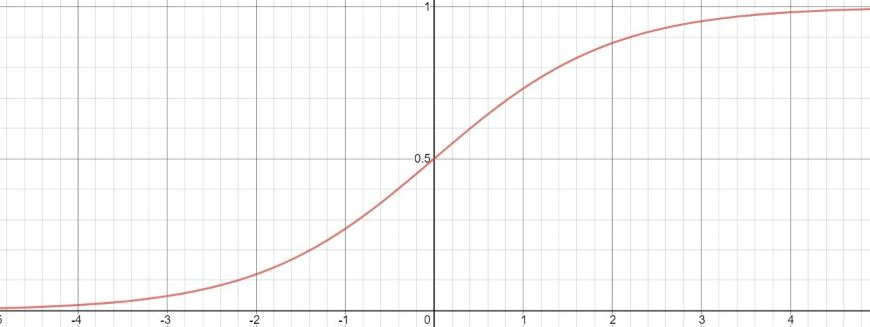

> *"So, but if you don't know, if you're less familiar with calculus, don't worry about it. I'm just going to tell you what you need to know in order to implement this algorithm to get it to work."*
> - Andrew Ng, [Coursera](https://youtu.be/B-Ks01zR4HY?t=210) 

 Source: image taken from [*Bounds for Sorting By Prefix Reversal*](https://pdfs.semanticscholar.org/58ec/3a02f4ffd14e2cc284076d7dd11994633de5.pdf) by Bill Gates 

### ReLU vs Sigmoid

So I'm going to cheat a little bit and write about something I learned from a video, not a research paper. Most everyone knows that a reason why Deep Learning is more popular these days is that they have large amounts of data to work with. Lesser known (I think), is that their success is also tied to faster computation algorithms. Traditionally, neural networks have used sigmoid functions for their activation functions. However, sigmoid functions can be slow because, at the tail ends of the graph (as x approaches negative infinity or positive infinity), their gradients are near 0. Since the gradients are near zero, these neural networks "learn" at a much slower rate. More recently, users switched over to a Rectified Linear Unit, or ReLU, activation function. In a ReLU graph, you see that the gradients at values where x is greater than 0 will have much higher gradients than those at in the sigmoid function. Since the gradients are greater, the algorithms can learn at a much faster rate.

